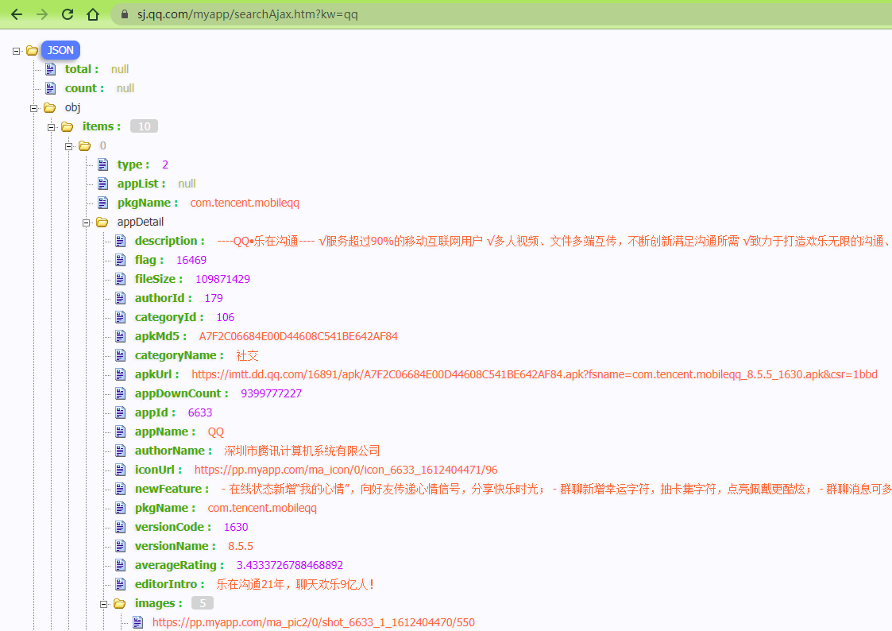
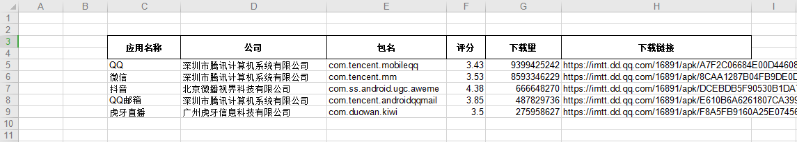

## 提取腾讯应用宝app信息并导出excel记录

有一天女朋友在电脑前办公，偷瞄了下，发现这是多么无聊且重复的工作啊！于是决定一定要帮她解放双手！Do it !

## 所需包

- requests
- xlwt （python写excel）

## 使用
1. 修改```run.py```中的```app_list```值，参照格式改为自己所需的应用名称；
2. 然后进入当前目录下，命令执行```python run.py```

## 要点

- 分析网页得知，该页是有**js动态加载**的数据，所以要想**抓取动态数据**，就要知道网页是如何加载数据的，这样的过程称为逆向工程。通过分析AJAX请求，来得到**JSON格式的数据**，再使用Python的json等模块去解析为字典，最终获取到自己想要的数据。

##展示图
|   搜索应用  |   应用详情  | 搜索所得json数据 |
| --- | --- | --- |
|  |  |  |

最终结果


## 扩展

- 第二种处理API接口数据方法，可以使用 ```json```包
```
  import json
  import urllib.request

  data = urllib.request.urlopen(api_url).read()

  # 转换正字符串
  strs = str(data)

  # 转换为json
  jsonData = json.dumps(strs)

  # 转换为字典数据
  data = json.loads(data)

  print(data)
```

- 读取excel内容，加载包```xlrd```

## 完成时间
- 2021-02-25