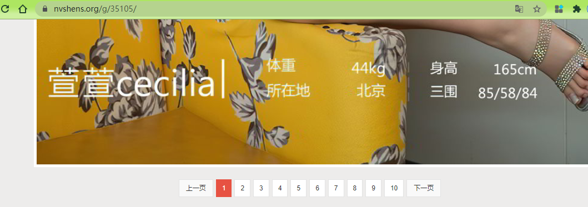

## 百万美女在手不是梦

长夜漫漫，兄弟你听我说！我真的是在搞学习！

## 所需包

- os
- re
- bs4
- lxml
- requests

## 要点
- re、etree、BeautifulSoup三种方式抓取同一内容比较
- 网站有一定的防抓机制，下载图片必须要有正确的header，不然会301 or 400
- 三步走：从抓取起始页 -> 单组图浏览页 -> 分页， 渐入层，没有整理好，也没有排错机制，自己看着办吧~
- ```use_soup``` 加载分页，逐步请求，全部抓取（仅第一个显示的分页）；```use_re``` 不加载分页，根据图片名称规律加载图片20页；```use_xpath``` 默认仅取第一页图片

## 展示图

|   美女图片  |  图片详情 |  图片详情分页 |
| --- | --- | --- |
|  |  |  |

最终结果


## 扩展
- r'': 一般用在正则表达式中，称为原始字符串，作用是将Python语法中的反斜杠转义给取消，将其设置成为一个普通的字符串。可以解决Python中的转义字符和正则表达式中的转义字符之间的冲突问题。
- re.S：作用就是将目标字符串中的换行符\n当做一个普通的zifu进行处理，让正则匹配的时候，不再受到换行符的影响，将所有行的字符串看成一个整体进行匹配。

##完成时间
- 2021-03-01
